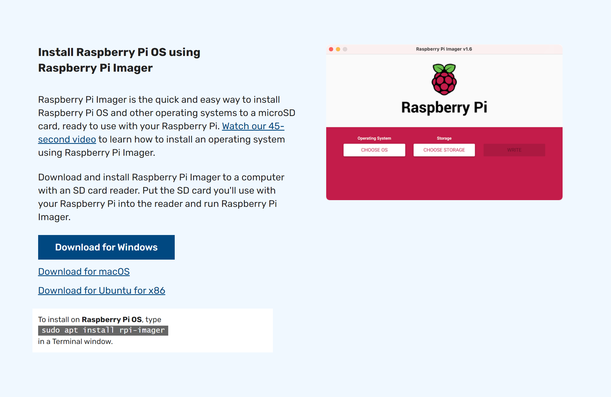
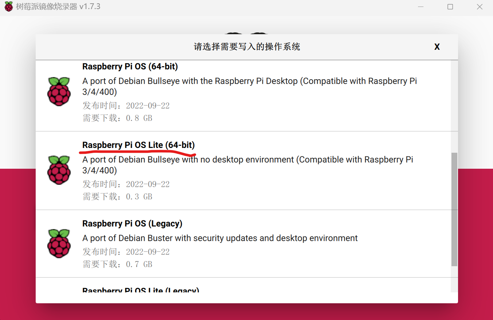
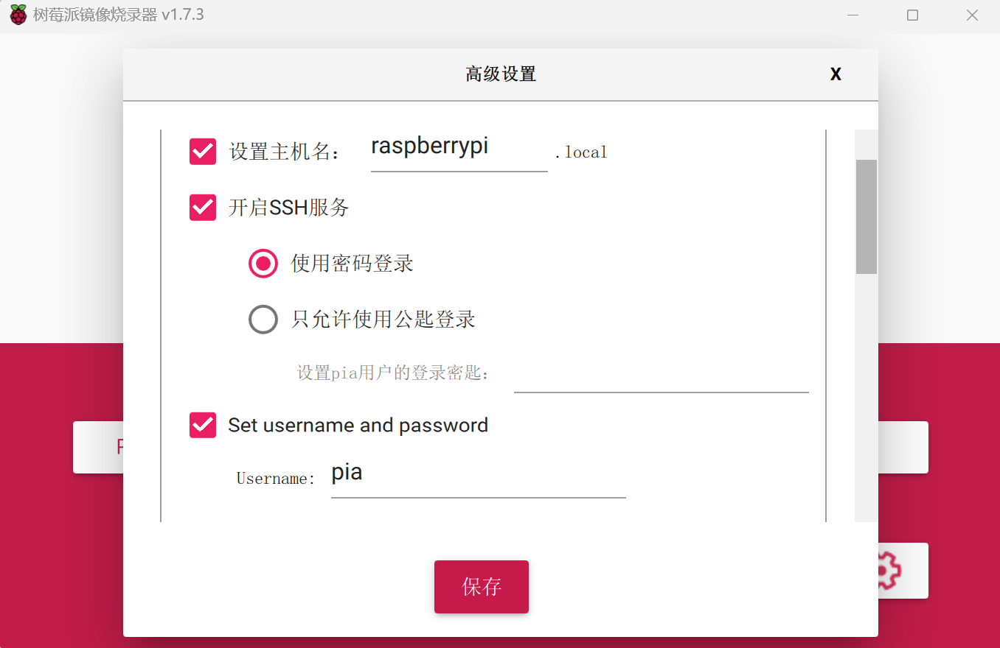

# 树莓派配置

## 硬件配置

```
型号：Raspberry Pi 4B
CPU主频：1.5GHz
CPU核心：4
CPU架构：ARM64
内存：8G
外存：64G
```

其他参数不是考虑范围内，所以不列出

之所以购买`Raspberry Pi 4B`而不购买其他型号，是因为4B提供强劲的CPU和足够大的内存空间

## 软件配置

```
操作系统：Raspberry Pi OS Lite (64-bit)
```

## 安装操作系统

首先需要一张SD卡，SD卡将存放操作系统引导程序和操作系统，我们在这里选用64G大小的SD卡

我们需要安装[`Raspberry Pi Imager`](https://www.raspberrypi.com/software/)，这个软件是官方提供烧入操作系统的软件，可以帮助我们快速部署操作系统



SD卡尽量保证是一个空卡，可以打开Windows设备管理器，找到SD对应的物理硬盘，删除上面所有分卷

打开`Imager`，选择烧入的操作系统，这里我们选择Raspberry Pi OS Lite (64-bit)

Lite表示将没有图形界面，可以大大节省占用空间，另外，后续对树莓派操作都是在ssh上操作，因此我们不需要图形界面



配置主机名，后续是通过主机名让节点之间相互访问

我们先给一个树莓派取名为rasp-master

接着我们配置ssh，保证我们可以通过ssh登录到我们的树莓派

然后配置用户名与密码，一定要记住用户名与密码，这是我们操作系统登录用户名和密码，是不能忘记的

接着我们配置wifi，这样树莓派启动时就会连接到指定的wifi，而不需要网线连接



配置完成后就开始烧录，等进度条完成后，就可以拔出SD卡，然后插入到树莓派，将树莓派插电

在PowerShell或者bash上输入命令

```shell
#username是树莓派用户名
#hostname是树莓派主机名
ssh username@hostname
```

接着输入密码，回车，到这里应该能登录到树莓派

## 配置操作系统

更新软件包：

ssh登录到树莓派后，`sudo apt update && sudo apt upgrade -y`更新软件包

修改root密码：

`sudo passwd root`修改root密码

关闭swap分区：

`sudo nano /etc/dphys-swapfile`，将CONF_SWAPSIZE设为0

`sudo dphys-swapfile swapoff`，关闭swap分区

然后`reboot`重启树莓派

`free`检查是否还有swap分区

拓展文件系统：

树莓派不会立即将全部SD卡空间用于使用

`sudo raspi-config`

Advanced Options -> Expand Filesystem